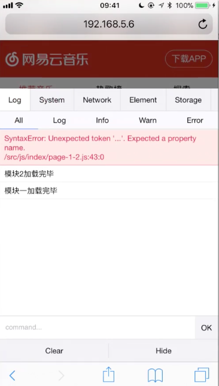

# NetEaseMusic
## 如何调适手机页面
1、首先将手机连接到PC端的同一个WiFi下
2、命令行开启 http-server -c-1 第一个用作PC端访问，第二个用作移动端
3、log 大法
- 由于手机没有 console ，可以选择使用 alert
- 可以自己造一个 console ，腾讯的 vConsole（在手机页面上就可以看到像控制台一样打印出的东西）

eg:


- 监听 window.onerror 
```
<div id="consoleOutput"></div>  // 创建一个区域展示打印出的东西

window.console = {
    log(x){
        let p = document.creatElement('p')
        p.innreText = x
        consoleOutput.appendChild(p)
    }
}
window.onerror = function(message, file, row){
    console.log(message)  // 展示错误信息
    console.log(file)  // 显示错误所在文件
    console.log(row)  // 错误所在行数
}
```